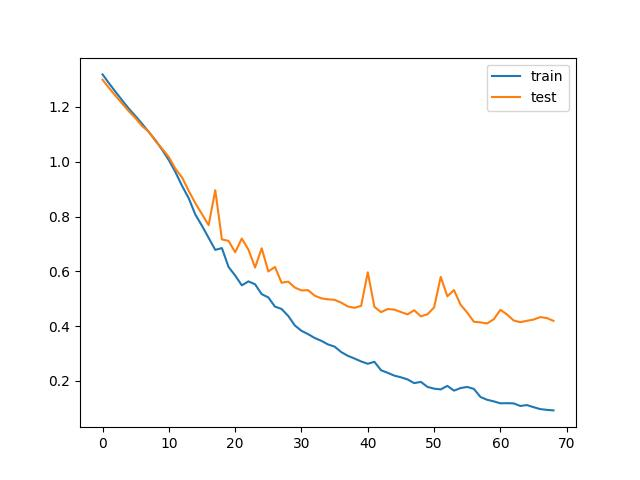

# Basketball

# An Example of CNN on MNIST dataset

Detailes of the CNN strucdure in the demo, as well as the mathematical derivation of 
backpropagation can be found in ["Derivation of Backpropagation in Convolutional Neural Network (CNN)"](doc/Derivation_of_Backpropagation_in_CNN.pdf), which is specifically written for this demo.  

The implementation of CNN uses the trimmed version of DeepLearnToolbox by [R. B. Palm](https://github.com/rasmusbergpalm/DeepLearnToolbox). 

## Contents
* [Pre-requisite](#Requirements)
* [IMU dataset](#IMUdataset)
  * [Some samples of digit images](#samples)
* [Preprocess](#Preprocess)
* [CNN structure](#CNNstructure)
* [Run the demo](#Run)
* [Results](#Results)
  * [Training/testing accuracy vs. epoch](#accuracy)
  * [Training error vs. epoch](#Error)


<a name="Requirements">

## Pre-requisite
* Python 3.7
* Keras
* Tensorflow
* sklearn

<a name="Preprocess">

## Preprocess


<a name="IMUdataset">

## IMU dataset
In the IMU dataset, there are 888 shootings digit images for training and 223 for testing. The image size is 21x33xnumber of features, and the athletes are professional and rereational (binary categories). 


<a name="CNNstructure">

## CNN structure in the demo


<a name="Run">

## Run the demo

```
>> demo_CNN_MNIST
```

Note that only 1 epoch will be performs. If you want to run more epochs, please modify the variable `num_epochs ` in the file [`demo_CNN_MNIST.m`](https://github.com/ZZUTK/An-Example-of-CNN-on-MNIST-dataset-/blob/master/demo_CNN_MNIST.m) (line 62).

<a name="Results">

## Results
Running the demo for 200 epochs, the classification accuracy is shown as follow. Note that the results may be a little bit different for each running because of the random initialization of convolutional kernels.

| input | Testing loss | Testing accuracy |
| :---: | :---: | :---: |
| Ax | 0.5 | 82% |
| Ay | 99.34% | 99.02% |
| Az | 99.34% | 99.02% |


<a name="accuracy">

### Training and testing accuracy vs. epoch


<a name="Error">

### Training error in Mean Square Error (MSE) 
The loss function used in this demo is 




